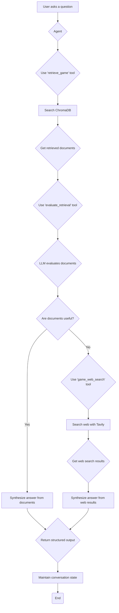

# UdaPlay: A Market Research Agent for the Gaming Industry

This project is a sophisticated AI-powered market research agent designed to provide insightful and accurate information about the video game industry. It leverages a Retrieval-Augmented Generation (RAG) pipeline, a stateful agent, and a web search fallback to deliver comprehensive and well-cited answers to user queries.

## Features

-   **Retrieval-Augmented Generation (RAG):** The agent uses a local vector database (ChromaDB) to provide fast and accurate information about a wide range of video games.
-   **Stateful Agent:** The agent can handle multiple queries in a session, remembering previous context to provide more relevant and personalized responses.
-   **Web Search Fallback:** If the agent's internal knowledge is insufficient, it can perform a web search using the Tavily API to find the most up-to-date information.
-   **Well-Cited Answers:** The agent provides clear and structured answers, always citing its sources to ensure transparency and accuracy.

## Tech Stack

-   **Python:** The core programming language used for the project.
-   **ChromaDB:** A persistent vector database for storing and querying game information.
-   **OpenAI:** The language model used for the agent's reasoning and evaluation capabilities.
-   **Tavily:** The web search API used for the agent's fallback mechanism.
-   **Jupyter:** The interactive development environment used for building and testing the agent.

## Setup and Installation

1.  **Clone the repository:**
    ```bash
    git clone https://github.com/your-username/udaplay-market-research-agent.git
    ```
2.  **Create a virtual environment:**
    ```bash
    python -m venv venv
    source venv/bin/activate
    ```
3.  **Install the required dependencies:**
    ```bash
    pip install -r requirements.txt
    ```
4.  **Create a `.env` file** in the root of the project and add the following API keys:
    ```
    OPENAI_API_KEY="your-openai-api-key"
    CHROMA_OPENAI_API_KEY="your-openai-api-key"
    TAVILY_API_KEY="your-tavily-api-key"
    ```

## Usage

1.  **Build the vector store:** Run the `Udaplay_01_solution_project.ipynb` notebook to build the vector store.
2.  **Interact with the agent:** Run the `Udaplay_02_solution_project.ipynb` notebook to interact with the agent.

## Project Structure

```
.
├── .gitignore
├── README.md
├── requirements.txt
├── submissions
│   ├── Udaplay_01_solution_project.ipynb
│   └── Udaplay_02_solution_project.ipynb
└── projects
    └── building-agents
        └── src
            └── project
                ├── starter
                │   ├── games
                │   └── lib
                └── ...
```

## Workflow

### Offline RAG: Data Ingestion

```mermaid
graph TD
    A[Start] --> B{Read Game Data};
    B --> C[For each JSON file];
    C --> D{Extract Game Info<br/>(Name, Platform, Genre, etc.)};
    D --> E[Construct Document String];
    E --> F{Connect to ChromaDB};
    F --> G[Get 'udaplay' Collection];
    G --> H{Embed Document<br/>using OpenAI};
    H --> I[Add Document to Collection];
    C --> J(Done Reading Files);
    I --> C;
    J --> K[End];
```

### Online Agent: Query Processing



## License

This project is licensed under the MIT License. 