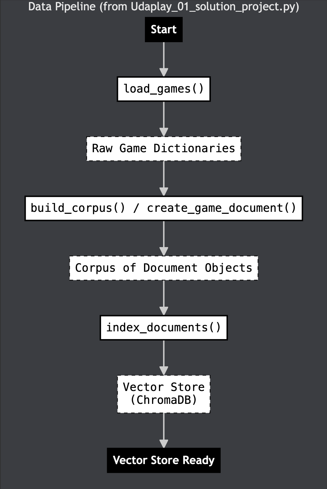
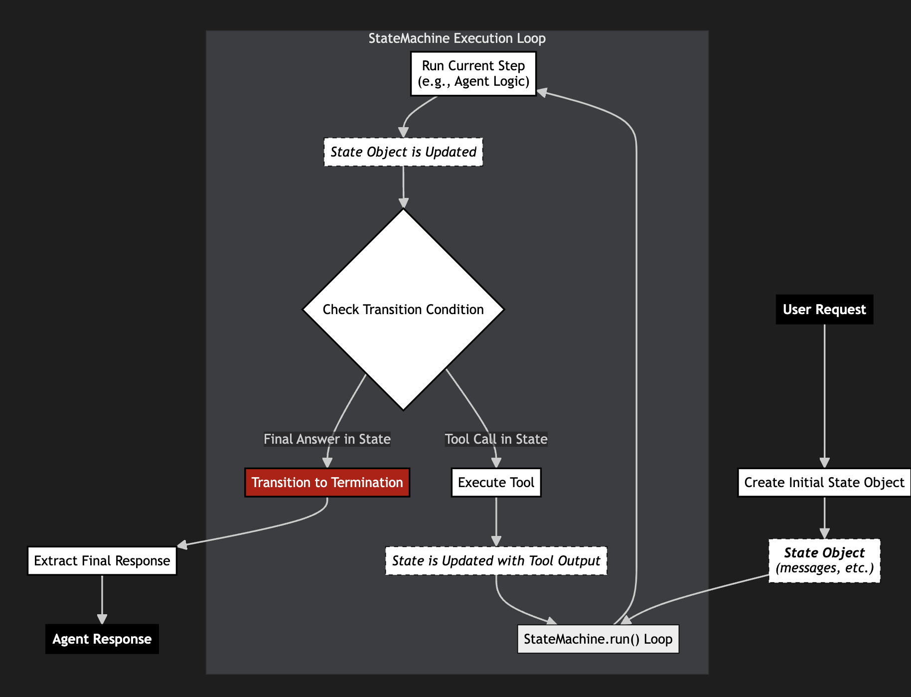
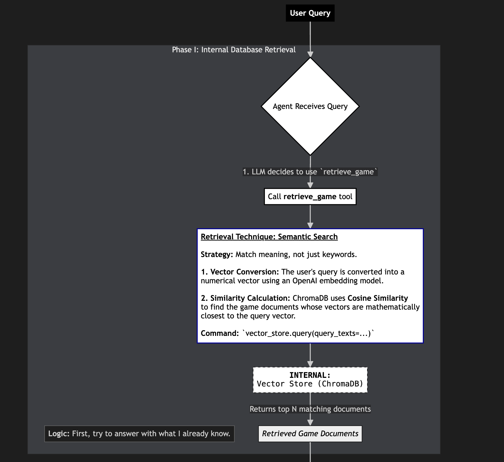
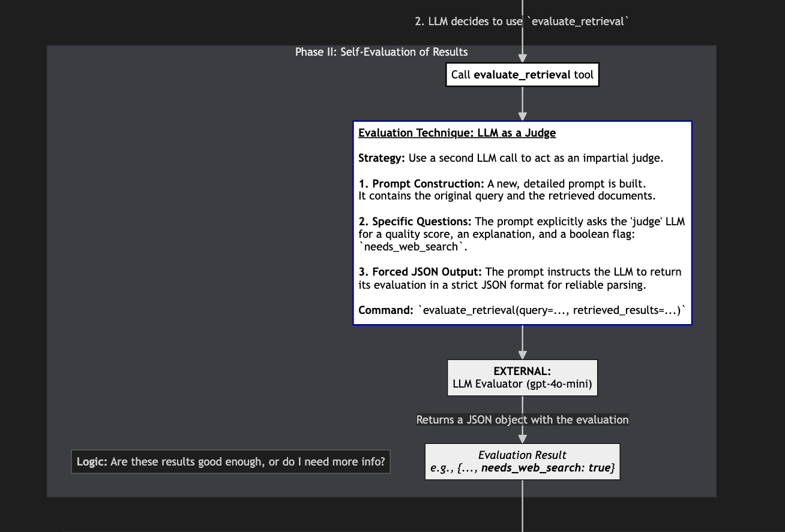
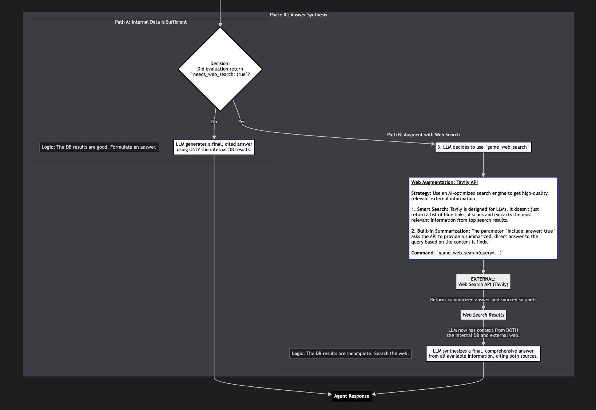

# UdaPlay: A Market Research Agent for the Gaming Industry

This project is a sophisticated AI-powered market research agent designed to provide insightful and accurate information about the video game industry. It leverages a Retrieval-Augmented Generation (RAG) pipeline, a stateful agent, and a web search fallback to deliver comprehensive and well-cited answers to user queries.

## Project Architecture & Logic

### Data Ingestion Pipeline

This diagram shows how raw game data is processed and indexed into a searchable vector database.



### State Machine Logic

This diagram explains why a state machine is a suitable architecture for managing the agent's cyclical thought process.



### Agent Logic & Workflow

The core agent logic follows a RAG (Retrieval-Augmented Generation) -> Evaluate -> Web Search workflow. This multi-phase process ensures that the agent provides the most accurate and comprehensive answers by first consulting its internal knowledge, evaluating the quality of that information, and only then resorting to external web searches if necessary.

#### Phase I: Internal Database Retrieval

The agent first attempts to answer the user's query using its internal vector database. This phase focuses on efficient retrieval of relevant information through semantic search.



#### Phase II: Self-Evaluation of Results

In this critical phase, the agent uses an LLM to act as a "judge" to evaluate the quality of the information retrieved from the internal database.



#### Phase III: Answer Synthesis & Web Augmentation

Based on the evaluation, the agent either synthesizes a final answer from the internal data or performs a web search to augment its knowledge before providing a response.



---

## Features

-   **Retrieval-Augmented Generation (RAG):** The agent uses a local vector database (ChromaDB) to provide fast and accurate information about a wide range of video games.
-   **Stateful Agent:** The agent can handle multiple queries in a session, remembering previous context to provide more relevant and personalized responses.
-   **Web Search Fallback:** If the agent's internal knowledge is insufficient, it can perform a web search using the Tavily API to find the most up-to-date information.
-   **Well-Cited Answers:** The agent provides clear and structured answers, always citing its sources to ensure transparency and accuracy.

## Tech Stack

-   **Python:** The core programming language used for the project.
-   **ChromaDB:** A persistent vector database for storing and querying game information.
-   **OpenAI:** The language model used for the agent's reasoning and evaluation capabilities.
-   **Tavily:** The web search API used for the agent's fallback mechanism.
-   **Jupyter:** The interactive development environment used for building and testing the agent.

## Setup and Installation

1.  **Clone the repository:**
    ```bash
    git clone https://github.com/your-username/udaplay-market-research-agent.git
    ```
2.  **Create a virtual environment:**
    ```bash
    python -m venv venv
    source venv/bin/activate
    ```
3.  **Install the required dependencies:**
    ```bash
    pip install -r requirements.txt
    ```
4.  **Create a `.env` file** in the root of the project and add the following API keys:
    ```
    OPENAI_API_KEY="your-openai-api-key"
    CHROMA_OPENAI_API_KEY="your-openai-api-key"
    TAVILY_API_KEY="your-tavily-api-key"
    ```

## Usage

1.  **Build the vector store:** Run the `Udaplay_01_solution_project.ipynb` notebook to build the vector store.
2.  **Interact with the agent:** Run the `Udaplay_02_solution_project.ipynb` notebook to interact with the agent.

## Project Structure

```
.
├── .gitignore
├── README.md
├── requirements.txt
├── submissions
│   ├── Udaplay_01_solution_project.ipynb
│   └── Udaplay_02_solution_project.ipynb
└── projects
    └── building-agents
        └── src
            └── project
                ├── starter
                │   ├── games
                │   └── lib
                └── ...
```


## License

This project is licensed under the MIT License. 